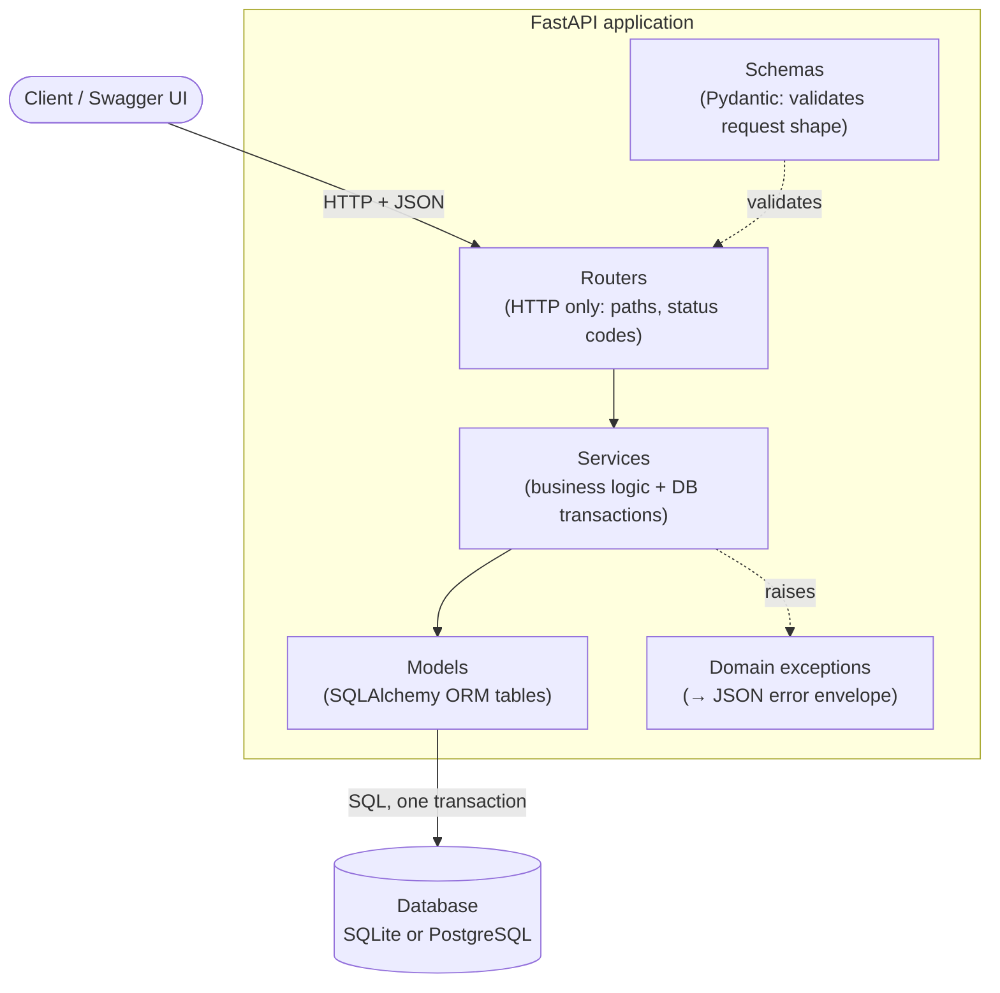
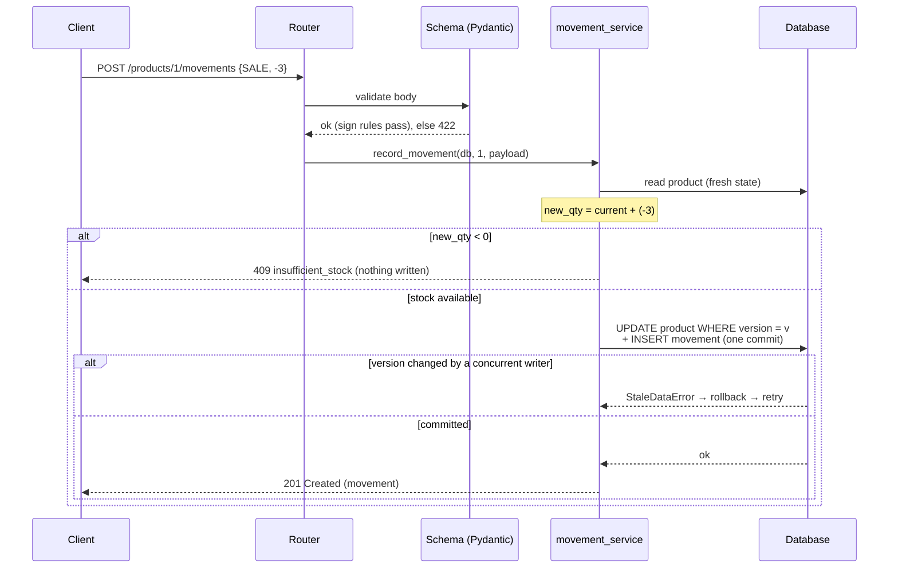
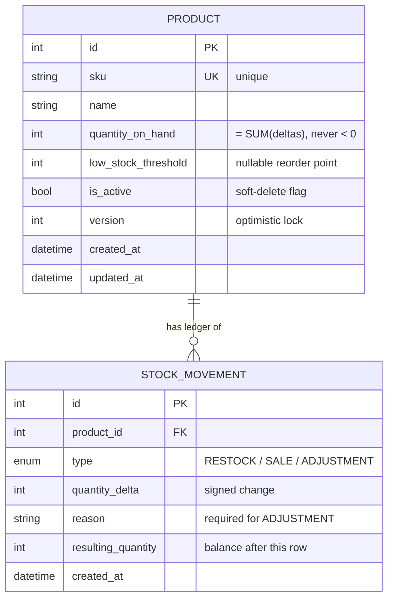
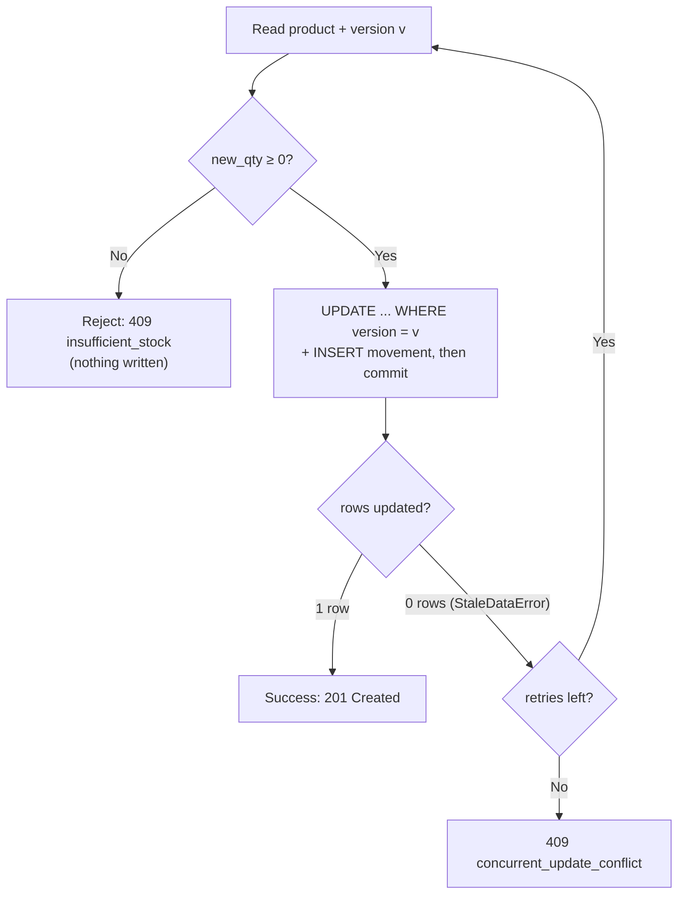

# Inventory & Stock-Movement Service

A backend service for a single-warehouse e-commerce team that tracks stock
levels per product and records **every** stock movement (restocks, sales,
adjustments) in an immutable ledger for later reconciliation.

Built with **Python + FastAPI** (+ SQLAlchemy 2.0 and Pydantic v2).

The whole design turns on one invariant, enforced everywhere:

> **`product.quantity_on_hand` is always exactly the sum of that product's movement ledger.**
> The only way to change stock is to append a movement, and the movement plus
> the new quantity are written in a single database transaction — so they can
> never drift apart.

---

## Contents
- [What it does](#what-it-does)
- [Architecture at a glance](#architecture-at-a-glance)
- [How a request flows](#how-a-request-flows)
- [Quick start](#quick-start)
- [Running the tests](#running-the-tests)
- [API reference](#api-reference)
- [Data model](#data-model)
- [Key design decisions](#key-design-decisions)
- [Example requests](#example-requests)
- [System Design Reflection](#system-design-reflection)
- [Deliberate non-goals & future work](#deliberate-non-goals--future-work)
- [Project structure](#project-structure)

---

## What it does

**Core requirements — all implemented**

- ✅ Products with unique **SKU**, **Name**, and **Quantity on Hand**
- ✅ Three movement types: **RESTOCK** (increase), **SALE** (decrease),
  **ADJUSTMENT** (either direction, **reason required**)
- ✅ A SALE that would drop quantity below zero is **rejected**
- ✅ Every movement stores type, signed delta, and timestamp, and is **never
  modified or deleted** after creation
- ✅ **CRUD** for products
- ✅ Endpoint to record a movement that **updates quantity in the same transaction**
- ✅ Endpoint to view a product's **full movement history, chronologically**

**Bonus — all implemented**

- ✅ Product deletion is **blocked when movements exist** (deactivate instead)
- ✅ **Pagination** on movement history
- ✅ **Optimistic locking** (version column) for safe concurrent updates
- ✅ **Low-stock threshold alert** endpoint

**Extras that go beyond the brief**

- A `resulting_quantity` snapshot on every movement so the ledger can be
  reconciled row-by-row without recomputing history
- Opening stock recorded as a movement, so the invariant holds from the first row
- Consistent JSON error envelope with stable machine-readable codes
- A real **concurrency test** proving no oversell under parallel load
- Runs on SQLite (zero setup) **or** PostgreSQL (Docker) with no code change
- GitHub Actions CI (lint + tests), Dockerfile, docker-compose, seed script

---

## Architecture at a glance

The code is split into layers so each part has one job. A request always flows
**router → service → model**, with schemas guarding the edge and domain
exceptions turning into clean JSON errors. This separation between the product
catalogue and the movement ledger is a core design goal.



| Layer | Folder | Responsibility |
| ----- | ------ | -------------- |
| Routers | `app/routers/` | HTTP only — receive the request, call a service, return the result |
| Schemas | `app/schemas.py` | Validate the *shape* of requests, define response format |
| Services | `app/services/` | The real logic: transactions, never-negative rule, concurrency |
| Models | `app/models.py` | The two database tables + invariants (constraints, immutability) |
| Exceptions | `app/exceptions.py` | Domain errors mapped to HTTP status + a stable code |

A useful rule of thumb: **schemas** validate the *shape* of a request (is the
delta a number? does an ADJUSTMENT have a reason?), while **services** validate
against the *live database state* (would this sale go below zero right now?).

## How a request flows

Recording a sale is the whole system in miniature — validation, the
never-negative rule, one atomic transaction, and safe concurrency:



---

## Quick start

Requires Python 3.11+.

```bash
# 1. install
pip install -r requirements.txt

# 2. (optional) load some sample data
python -m scripts.seed

# 3. run
uvicorn app.main:app --reload
```

Then open the interactive API docs at **http://localhost:8000/docs**
(Swagger UI, generated automatically by FastAPI).

That's it — it uses a local SQLite file (`inventory.db`) by default, so there's
nothing else to install.

### Run against Supabase (hosted Postgres)

The service is database-agnostic — it runs on Postgres with no code change, only
a different `DATABASE_URL`. To point it at a [Supabase](https://supabase.com)
project:

1. Create a project in Supabase (free tier is fine).
2. In the dashboard click **Connect** and copy the **Session pooler** URI. This
   mode is recommended for a long-running server: it's IPv4-friendly and works
   with SQLAlchemy out of the box.
3. Adjust it for SQLAlchemy: change the scheme `postgresql://` →
   `postgresql+psycopg2://` (the username stays in the `postgres.<PROJECT_REF>`
   form), and export it:

   ```bash
   export DATABASE_URL="postgresql+psycopg2://postgres.<PROJECT_REF>:<PASSWORD>@aws-0-<REGION>.pooler.supabase.com:5432/postgres?sslmode=require"
   uvicorn app.main:app
   ```

The app creates its tables automatically on startup, so that's all you need.
Prefer to set the schema up first? Paste [`scripts/schema.sql`](scripts/schema.sql)
into the Supabase **SQL Editor** and run it — it's generated from the models, so
it matches exactly. See [`.env.example`](.env.example) for the direct-connection
variant too.

> Why the Session pooler (port 5432) rather than the Transaction pooler
> (6543)? Session mode behaves like a normal Postgres connection and supports
> prepared statements, which psycopg2 uses by default. Transaction mode is
> aimed at serverless/edge functions.

### Run against a local Postgres (offline, no account)

```bash
docker compose up --build
```

This starts a local Postgres + the API together via Docker — handy for
developing the Postgres path with no external account. Same code, same schema.

### Deploying it

For a live demo, deploy to a host that runs a persistent process (Render,
Railway, or Fly.io) and set `DATABASE_URL` to your Supabase Session-pooler
string. Avoid serverless platforms like Vercel for this service: it's a stateful
API with a database, and its transactional/optimistic-locking guarantees assume
a long-lived connection to a shared Postgres rather than ephemeral function
invocations.

---

## Running the tests

```bash
pytest
```

27 tests cover product CRUD, all three movement types, the never-go-negative
rule, immutability, pagination, low-stock alerts, and concurrency. Highlights:

- `tests/test_movements.py::test_sale_below_zero_is_rejected`
- `tests/test_movements.py::test_ledger_invariant_holds_after_many_movements`
- `tests/test_immutability.py::test_orm_guard_blocks_movement_update`
- `tests/test_concurrency.py::test_no_oversell_under_concurrent_sales` — fires
  dozens of simultaneous SALEs at one product and asserts stock never goes
  negative and is never oversold.

---

## API reference

| Method   | Path                                   | Description                                            |
| -------- | -------------------------------------- | ------------------------------------------------------ |
| `POST`   | `/products`                            | Create a product (optional opening stock)              |
| `GET`    | `/products`                            | List products (`?include_inactive=`, `?limit=`, `?offset=`) |
| `GET`    | `/products/{id}`                       | Get one product                                        |
| `PATCH`  | `/products/{id}`                       | Update name / low-stock threshold (**not** quantity)   |
| `DELETE` | `/products/{id}`                       | Delete — **409 if movements exist** (deactivate instead) |
| `POST`   | `/products/{id}/deactivate`            | Soft-delete: mark inactive                             |
| `POST`   | `/products/{id}/activate`              | Reactivate                                             |
| `POST`   | `/products/{id}/movements`             | **Record a movement (updates quantity atomically)**    |
| `GET`    | `/products/{id}/movements`             | Movement history, chronological, paginated             |
| `GET`    | `/alerts/low-stock`                    | Products at/below their reorder point (`?threshold=` to override) |
| `GET`    | `/health`                              | Liveness check                                         |

**Errors** use a consistent envelope with a stable `code`:

```json
{ "error": { "code": "insufficient_stock", "message": "Rejected: 3 on hand, change of -5 would result in -2" } }
```

Codes include `product_not_found` (404), `duplicate_sku`,
`insufficient_stock`, `product_has_movements`, `product_inactive`,
`concurrent_update_conflict`, `immutable_record` (all 409), and
`validation_error` (422).

---

## Data model

Two tables, deliberately separate — the product catalogue vs. the movement log.
One product has many movements; the movements are its append-only ledger.




**`products`**

| column                | notes                                                        |
| --------------------- | ------------------------------------------------------------ |
| `id`                  | PK                                                           |
| `sku`                 | unique, indexed                                              |
| `name`                |                                                              |
| `quantity_on_hand`    | current stock; a projection of the ledger (`>= 0` enforced)  |
| `low_stock_threshold` | optional reorder point                                       |
| `is_active`           | soft-delete flag                                             |
| `version`             | optimistic-locking counter                                   |
| `created_at` / `updated_at` |                                                        |

**`stock_movements`** (append-only)

| column               | notes                                                         |
| -------------------- | ------------------------------------------------------------- |
| `id`                 | PK (monotonic → also the chronological order)                 |
| `product_id`         | FK → products                                                 |
| `type`               | `RESTOCK` / `SALE` / `ADJUSTMENT`                             |
| `quantity_delta`     | **signed** change (`RESTOCK > 0`, `SALE < 0`, `ADJUSTMENT ≠ 0`) |
| `reason`             | required for `ADJUSTMENT`                                     |
| `resulting_quantity` | running balance snapshot **after** this movement              |
| `created_at`         | indexed                                                       |

---

## Key design decisions

**1. The ledger is the single source of truth.**
`quantity_on_hand` can never be set directly through the API (the update schema
has no quantity field). Stock only changes by appending a movement. This makes
`quantity == SUM(deltas)` a hard invariant and reconciliation trivial. Even
opening stock at product creation is recorded as an `ADJUSTMENT` ("Opening
balance") so the invariant holds from the very first row.

**2. Atomicity via one transaction.**
Recording a movement updates the product's quantity **and** inserts the ledger
row inside a single `commit()`. Either both land or neither does — the quantity
and the log physically cannot drift out of sync. (See
`app/services/movement_service.py`.)

**3. Never go negative — checked before writing.**
The service computes `new_quantity` and rejects with `409 insufficient_stock`
*before* touching the database if it would go below zero. A `CHECK` constraint
(`quantity_on_hand >= 0`) is a second line of defence at the DB level.

**4. Immutable movements, enforced two ways.**
There are no update/delete routes for movements, *and* an ORM event guard raises
`ImmutableRecordError` if code ever tries to mutate or delete a persisted
movement.

**5. Safe under concurrency (optimistic locking).**
Each product carries a `version`. Updating it emits
`... WHERE version = <value read>` and bumps the version; if a concurrent
transaction already changed the row, the update hits 0 rows and SQLAlchemy
raises `StaleDataError`. We roll back, re-read fresh state, and retry — so the
retry sees the real quantity and is correctly rejected if stock is gone. This is
proven by the concurrency test. (More in the reflection below.)

**6. Signed `quantity_delta` as the stored value.**
A SALE of 5 is stored as `-5`. This keeps the "never negative" check trivial
(`quantity + delta >= 0`), makes reconciliation a plain `SUM()`, and avoids any
hidden server-side sign flipping. *Trade-off considered:* an alternative is a
positive magnitude plus a type-derived sign, but `ADJUSTMENT` needs an explicit
direction, so a uniform signed field is simpler and more honest.

**7. Delete vs. deactivate.**
Deleting a product that has history would destroy the audit trail, so it's
blocked (`409`); callers deactivate instead. A product with no movements can be
hard-deleted. The foreign key (with SQLite FK enforcement turned on) is a
database-level backstop.

---

## Example requests

```bash
# Create a product with 100 units and a reorder point of 20
curl -X POST localhost:8000/products \
  -H 'Content-Type: application/json' \
  -d '{"sku":"WIDGET-001","name":"Blue Widget","initial_quantity":100,"low_stock_threshold":20}'

# Sell 30 (note the negative delta)
curl -X POST localhost:8000/products/1/movements \
  -H 'Content-Type: application/json' \
  -d '{"type":"SALE","quantity_delta":-30}'

# Try to oversell -> 409 insufficient_stock
curl -X POST localhost:8000/products/1/movements \
  -H 'Content-Type: application/json' \
  -d '{"type":"SALE","quantity_delta":-9999}'

# Record a correction (reason required for ADJUSTMENT)
curl -X POST localhost:8000/products/1/movements \
  -H 'Content-Type: application/json' \
  -d '{"type":"ADJUSTMENT","quantity_delta":-2,"reason":"Damaged during audit"}'

# View paginated history (oldest first)
curl 'localhost:8000/products/1/movements?limit=20&offset=0'

# What's running low?
curl localhost:8000/alerts/low-stock
```

---

## System Design Reflection

*The section the brief asks for — how I think about scale and trade-offs.*

### 1. Two terminals record a SALE for the same product at nearly the same instant. What could go wrong, and how would you fix it?

**What goes wrong without protection:** a classic lost-update / oversell race.
Both terminals read `quantity_on_hand = 1`, both check "1 - 1 >= 0, so OK", and
both write `quantity = 0` while inserting a `SALE`. Two units are sold when only
one existed. Depending on interleaving you either oversell (the ledger shows two
`-1` movements) or corrupt the count. The root cause is that the
read → check → write sequence isn't atomic across transactions.

**How I fixed it (implemented):** optimistic locking. Each product has a
`version` column; SQLAlchemy adds `WHERE version = <value we read>` to the
UPDATE and increments the version. If another transaction committed first, our
UPDATE affects 0 rows and raises `StaleDataError`; we roll back, re-read the
now-correct quantity, and retry. The whole thing runs in one transaction, so the
movement and the quantity update commit together. Under contention exactly one
sale wins; the other retries and is correctly rejected once stock is gone. This
is covered by `tests/test_concurrency.py`, which fires dozens of simultaneous
sales and asserts stock never goes negative.



**Alternatives and trade-offs:**
- **Pessimistic locking** (`SELECT … FOR UPDATE`) locks the product row for the
  transaction, so the second terminal blocks until the first commits, then reads
  fresh state. Simpler mental model, but holds locks and can create contention
  under high load. Best for hot rows with heavy write contention.
- **Atomic conditional UPDATE** — push the rule into the database:
  `UPDATE products SET quantity_on_hand = quantity_on_hand + :delta WHERE id = :id AND quantity_on_hand + :delta >= 0`,
  treating "0 rows affected" as insufficient stock. Fully atomic with no
  read-modify-write in app space; the natural next step at very high throughput.

Optimistic locking is the right default here: low overhead, no long-held locks,
and it works identically on SQLite and Postgres.

### 2. How would your design change if the company grew from a single warehouse to 50 warehouses, each with its own stock?

The key modelling change is that **stock is no longer a single number per
product** — it becomes per **(product, warehouse)**.

- Introduce a `warehouses` table and move quantity into a `stock_levels` table
  keyed by `(product_id, warehouse_id)`, each row with its own
  `quantity_on_hand` and `version`. `products` becomes a global catalogue (SKU,
  name); SKU stays globally unique, but the stock row is unique per warehouse.
- Every movement gains a `warehouse_id`, so the ledger is naturally partitioned
  by warehouse. The "never negative" rule and optimistic lock now apply to the
  per-warehouse stock row — which actually **reduces** contention, since
  different warehouses no longer compete for the same row.
- **Transfers** between warehouses become a first-class operation: a paired
  out/in movement (or a `TRANSFER` type with source + destination) that must be
  atomic across two stock rows in one transaction.
- Reporting changes: "quantity on hand" is now per warehouse, with aggregate
  views for company-wide totals; low-stock thresholds become per-warehouse.

**On scale specifically:** 50 warehouses is still comfortably a single,
well-indexed relational database — the schema change above is the real work.
Sharding, per-warehouse services, read replicas for history/reporting, and
caching hot stock levels are all options if and when volume demands them, but
reaching for them now would be premature. The brief itself hints at this: the
skill is knowing which changes are needed at 50 warehouses (the data model) and
which are not yet (distributed infrastructure).

---

## Deliberate non-goals & future work

Scoped out on purpose to keep the service focused and correct:

- **Auth / users / multi-tenancy** — not part of the brief.
- **Alembic migrations** — the app auto-creates tables on startup for a
  friction-free run; production would use Alembic for versioned schema changes.
- **Async SQLAlchemy** — sync endpoints (run in FastAPI's threadpool) keep the
  transactional logic simple and easy to reason about; async is the next step
  for very high I/O concurrency.
- **Multi-warehouse** — see reflection #2 for exactly how I'd extend the model.
- **Push notifications for low stock** — currently a pull endpoint; a background
  job / webhook is the natural follow-up.

---

## Project structure

```
app/
  main.py                  # FastAPI app, routers, error handlers, /health
  config.py                # env-driven settings (DATABASE_URL, retries)
  database.py              # engine, session, Base, SQLite pragmas
  models.py                # Product, StockMovement, optimistic lock, immutability guard
  schemas.py               # Pydantic request/response contract + validation
  exceptions.py            # domain errors -> HTTP status + code
  services/
    product_service.py     # product CRUD, delete-vs-deactivate, low-stock
    movement_service.py    # the transactional core (atomic + optimistic lock)
  routers/
    products.py            # product endpoints
    movements.py           # movement + history endpoints
    alerts.py              # low-stock endpoint
tests/                     # 27 tests incl. concurrency & immutability
scripts/seed.py            # sample data
scripts/schema.sql         # Postgres DDL (paste into Supabase SQL editor)
Dockerfile, docker-compose.yml, Makefile, .github/workflows/ci.yml
```
